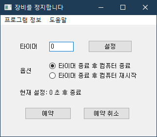

## AutoShutdown v1.0
---

* 제작자: 강지완 (a.k.a. boringariel)
* 이 프로그램은 [General Public License](https://github.com/boringariel/autoshutdown/blob/master/LICENSE)를 따릅니다 [(소스코드 보기)](https://github.com/boringariel/autoshutdown/blob/master/AutoShutdown.ipynb)

컴퓨터 자동 종료 커맨드를 자동으로 입력해 주는 GUI 프로그램입니다.
컴퓨터 자동 종료 예약, 재부팅 예약 및 예약 취소 기능을 지원합니다.

---
### **사용방법**
버전에 따라 UI 또는 글자가 일부 다를 수 있습니다.  

 

* '타이머' 항목에서 초 단위의 시간을 적은 뒤, '설정' 버튼을 눌러줍니다.
* '옵션' 항목에서 종료 또는 재시작 옵션을 선택해 줍니다.  

 
* 설정이 변경되거나 '예약' 버튼을 누르면 설정 또는 예약 상황을 하단에서 알려줍니다.
* 종료 예약을 한 경우, 프로그램을 종료해도 종료 예약은 유지됩니다.  

 
* '예약 취소' 버튼을 누르면 예약이 취소되었음을 알려줌과 동시에 종료 예약이 취소됩니다.  

---
### version history
* **v0.9**

테스트용 프로그램 제작

* **v1.0**

배포용 프로그램 제작
